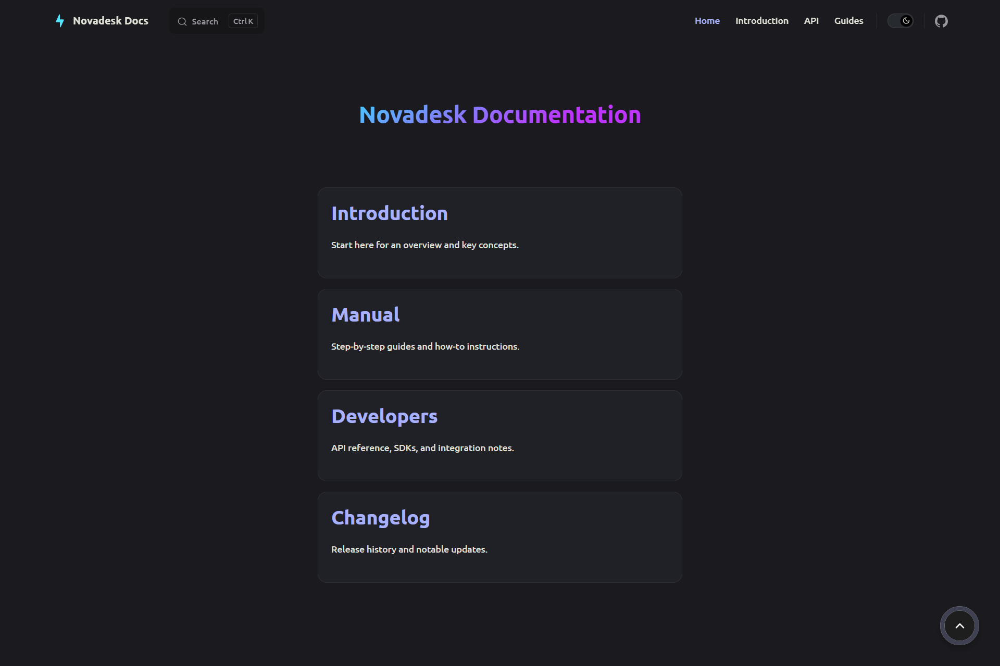

# Novadesk Documentation

Welcome to the Novadesk documentation repository. This folder contains comprehensive guides and documentation for the Novadesk project.

## Overview

Novadesk is a powerful desktop customization application that provides real-time system monitoring, widgets, and visual effects for your desktop environment.

## Preview

## Contributing

We welcome contributions to our documentation!

If you enjoy using Novadesk and want to support its development, consider becoming a patron:

- ☕ [Patreon](https://www.patreon.com/c/officialnovadesk) - Support the project's growth and get exclusive updates.